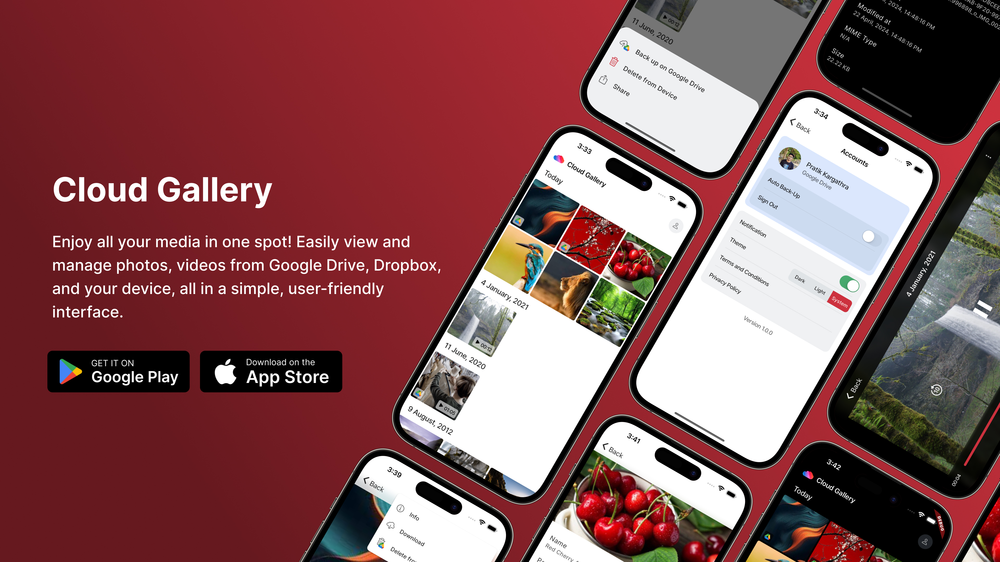

<p align="center"> <a href="https://canopas.com/contact"></a></p>

# Cloud Gallery: All Your Memories in One Spot
Enjoy all your media in one spot! Easily view and manage photos, videos from Google Drive, Dropbox, and your device, all in a simple, user-friendly interface.

<br/>

## Overview
Cloud Gallery is a Flutter application designed to seamlessly manage user media across multiple
cloud providers like Google Drive, Dropbox, while also allowing users to access and organize their
local media. With intuitive features and a user-friendly interface, Cloud Gallery simplifies media
management, offering convenience and accessibility.

<br/>

## Download App
<a href= "https://play.google.com/store/apps/details?id=com.canopas.cloudGallery"></img> 
<a href="https://apps.apple.com/us/app/"></img>

<br/>

## Features 🌟
- **Sync with Google Drive**:  Easily access and manage your photos and videos stored on your device and Google Drive account directly in one place. Enjoy the convenience of having your memories at your fingertips, wherever you go.
- **Auto Backup In Google Drive**: Worried about losing your cherished memories? Cloud Gallery's auto backup feature ensures that your local photos and videos are automatically backed up to your Google Drive account, keeping them safe and secure.
- **Effortless Uploads & Downloads**: Effortless Uploads & Downloads: Easily upload photos and videos from your device's local storage to your Google Drive account, and download files from Google Drive to your device with just a tap.
- **Access media in Multiple Devices**: Access your media seamlessly across multiple devices with our backup feature, ensuring your content is always at your fingertips
- **Stay Organized**: Arrange and categorize your photos and videos in your Google Drive account, making it easy to find and manage your media files.
- **Secure User Data**: We prioritize your privacy and security. Cloud Gallery utilizes your Google Drive storage, ensuring that your data remains secure within your own account.
- **Cross-Platform Compatibility**: Whether you're using an Android or iOS device, Cloud Gallery offers seamless compatibility across platforms.
- **User-Friendly Interface**: With an intuitive and user-friendly interface, Cloud Gallery makes it easy to manage your media files, ensuring a hassle-free experience.
> **Note**: Cloud Gallery is currently in active development 🚧, with plans to incorporate additional features shortly. Stay tuned for updates!

<br/>

## What's Coming Next? 🚀
- **Dropbox Integration**: Cloud Gallery will soon support Dropbox integration, allowing users to access and manage their media files dropbox.
- **Sharing Between Clouds**: Easily share your media files between Google Drive and Dropbox, making it convenient to access and manage your files across multiple cloud providers.
- **Auto Backup In Multiple Cloud**: Cloud Gallery will soon support backup in multiple cloud providers, ensuring that your media files are securely stored across multiple platforms.
- **Enhanced Security Features**: We're working on enhancing our security features to ensure that your data remains safe and secure.
- **Improved User Experience**: We're continuously working on improving the user experience, with plans to incorporate additional features and enhancements shortly.
- **Bug Fixes & Performance Improvements**: We're actively working on addressing any bugs and performance issues to ensure a seamless user experience.
- **Feedback & Suggestions**: We value your feedback and suggestions. If you have any ideas or suggestions, please let us know. We'd love to hear from you!

<br/>

## Technologies Stack 🖥️
Cloud Gallery utilizes the latest Flutter app development technologies and adheres to industry best practices. Below is the current technologies stack used in the development process:
- [Dart](https://dart.dev/)
- [Flutter](https://flutter.dev/)
- [Google Drive API](https://developers.google.com/drive/api/guides/about-sdk)
- [googleapis SDK](https://pub.dev/packages/googleapis)
- [Navigation 2.0 (Go Router)](https://pub.dev/packages/go_router)
- [Firebase](https://firebase.google.com/)
- [Riverpod](https://riverpod.dev/)
- [Dio](https://pub.dev/packages/dio)
- [Photo manager](https://pub.dev/packages/photo_manager)

#### Best Practices
- Clean Architecture (MVVM)
- Flutter Modularization
- Localization
- Dependency Injection
- State Management (Riverpod)
- Error Handling
- Code Generation
- Code Separation
- Responsive Design

<br/>

## Created & Maintained By
Cloud Gallery is owned and maintained by the [Canopas team](https://canopas.com/).

You can follow them on Twitter at [@canopassoftware](https://twitter.com/canopassoftware) for project updates and releases. If you are interested in building apps or designing products, please let us know. We'd love to hear from you!

<a href="https://canopas.com/contact"></a>

<br/>

## License 📄

**Cloud Gallery** is licensed under the Apache License, Version 2.0.

```
Copyright 2024 Canopas Software LLP

Licensed under the Apache License, Version 2.0 (the "License");
You won't be using this file except in compliance with the License.
You may obtain a copy of the License at

http://www.apache.org/licenses/LICENSE-2.0

Unless required by applicable law or agreed to in writing, software
distributed under the License is distributed on an "AS IS" BASIS,
WITHOUT WARRANTIES OR CONDITIONS OF ANY KIND, either express or implied.
See the License for the specific language governing permissions and
limitations under the License.
```