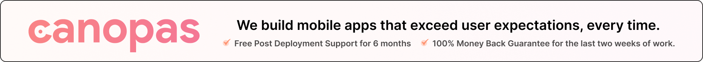
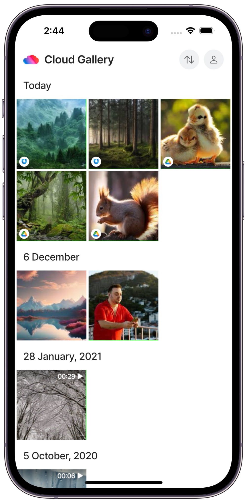
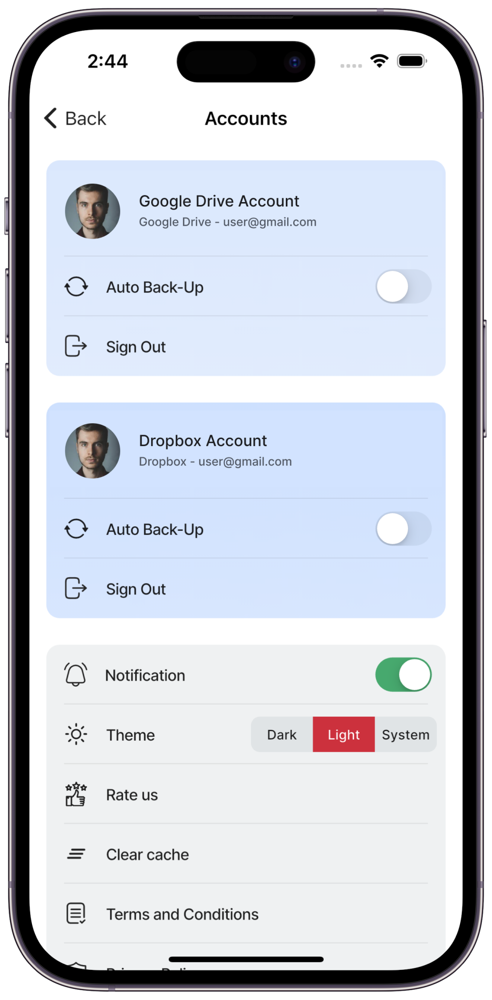
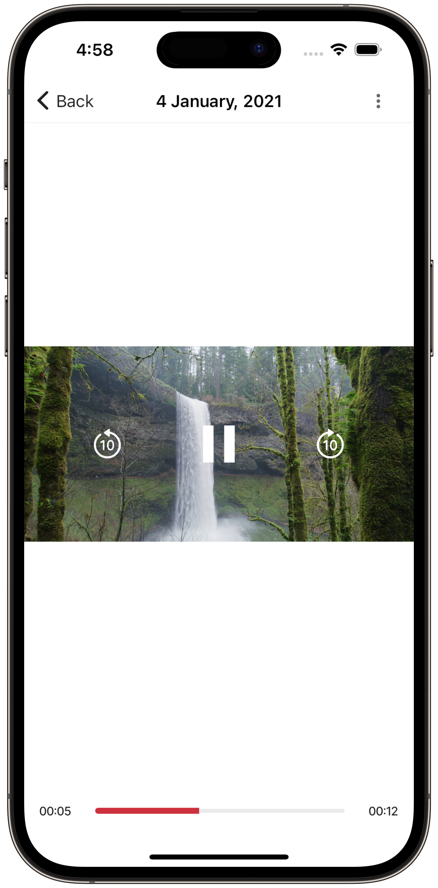

<p align="center"> <a href="https://canopas.com/contact"></a></p>

<br/>

# Cloud Gallery: All Your Memories in One Spot

Enjoy all your media in one spot! Easily view and manage photos, videos from Google Drive, Dropbox,
and your device, all in a simple, user-friendly interface.


<br/>

## Overview

Cloud Gallery is an open-source Flutter project that makes managing your photos and videos
effortless. Keep all your media in one place,
whether it’s stored locally or in the cloud with Google Drive or Dropbox. Automatically back up
your local media to the cloud, and seamlessly upload, download, or organize your files anywhere.
It’s the simplest way to keep your memories safe and accessible.

<br/>

## Download App

<a href="https://play.google.com/store/apps/details?id=com.canopas.cloud_gallery">  </a><a href="https://apps.apple.com/in/app/cloud-gallery/id6480052005?platform=iphone"></a>


<br/>

## Screenshots 📸

<table>
  <tr>
 <th  width="33%" >On-board</th>
  <th width="33%" >Home</th>
  <th  width="33%" >Accounts</th>
  </tr>
    <tr>
  <td></td>
  <td></td>
  <td>  </td>

  </tr>  
 <tr>
 <th  width="33%" >Multiple Media Selection</th>
  <th  width="33%">Upload & Download</th>
   <th  width="33%">Metadata Details</th>

  </tr>
    <tr>
 <td></td>
  <td>  </td>
  <td>  </td>
  </tr>  
<tr>
<th  width="33%">Video Preview</th>
  <th width="33%">Image Preview</th>
  <th  width="33%">Preview Actions</th>
  </tr>
    <tr>
 <td>  </td>
  <td></td>
  <td>  </td>
  </tr> 
</table>

<br/>

## Features 🌟

- **Sync with Cloud Providers**: Easily access and manage your photos and videos stored on both your
  device and cloud accounts like Google Drive and Dropbox, all in one place. Enjoy the convenience
  of having your memories at your fingertips, wherever you go.

- **Auto Backup to Cloud**: Never worry about losing your cherished memories again! Cloud
  Gallery’s auto backup feature ensures your local photos and videos are automatically backed up to
  either Google Drive or Dropbox, keeping them safe and secure.

- **Effortless Uploads & Downloads**: Upload photos and videos from your device’s local storage to
  your cloud account, and easily download files from Google Drive or Dropbox to your device with
  just a tap.

- **Access Media on Multiple Devices**: With the cloud feature, access your media seamlessly across
  multiple devices, ensuring your content is always at your fingertips, no matter where you are.

- **Stay Organized**: Organize and categorize your photos and videos in Google Drive or Dropbox,
  making it easy to find and manage your media files.

- **Secure User Data**: With an intuitive and user-friendly interface, Cloud Gallery makes it easy
  to manage your media files, ensuring a hassle-free experience.

- **Cross-Platform Compatibility**: Whether you're using an Android or iOS device, Cloud Gallery
  offers seamless compatibility across platforms.

- **User-Friendly Interface**: With an intuitive and user-friendly interface, Cloud Gallery makes it
  easy to manage your media files, ensuring a hassle-free experience.

> **Note**: Cloud Gallery is currently in active development 🚧, with plans to incorporate additional
> features shortly. Stay tuned for updates!

<br/>

## What's Coming Next? 🚀

- **Sharing Between Clouds**: Easily share your media files between Google Drive and Dropbox, making
  it convenient to access and manage your files across multiple cloud providers.

- **Custom Folders & Albums**: Create custom folders and albums to organize your media files, making
  it easy to categorize and manage your photos and videos.

- **Enhanced Search & Filter**: Quickly find and filter your media files with advanced search and
  filter options, making it easy to locate specific photos

- **Improve User Experience**: We're continuously working on improving the user experience, with
  plans to incorporate additional features and enhancements shortly.

<br/>

## Requirements & Project Setup  🛠️  
Ensure you have the latest stable versions of Flutter and Android Studio installed, along with the Flutter and Dart plugins.
After that, you can either clone this repository or import the project directly into Android Studio by following the steps outlined in the [documentation](https://developer.android.com/jetpack/compose/setup#sample).

<details>
     <summary> Click to expand </summary>

### Firebase Setup  
1. **Create a Firebase App**  
   - Go to the [Firebase Console](https://console.firebase.google.com/), create a new project, and configure it as needed.  

2. **Set up Firebase in your project**  
   - Follow the instructions in the official Firebase setup documentation for Flutter:  
     [Firebase Setup for Flutter](https://firebase.google.com/docs/flutter/setup)  

> **Note:** Cloud Gallery uses the following Firebase services:  
> - **Analytics**: This tracks user interactions and events in the app.  
> - **Crashlytics**: This monitors crashes and errors to improve app stability.  

### Dropbox Setup  
1. Create a Dropbox App with scoped access and full Dropbox access type in the [Dropbox App Console](https://www.dropbox.com/developers/apps).  
2. Obtain your **App Key** and **App Secret**.  

### Secrets Configuration  
Create a `secrets.dart` file at the following path inside the `data/apis/network` directory. This file will store your app secrets. Add the following class to manage them:  
  ```dart  
  class AppSecrets {  
    static const dropBoxAppKey = 'YOUR DROPBOX APP KEY';  
    static const dropBoxAppSecret = 'YOUR DROPBOX APP SECRET';  
  }  
```
### Get Dependencies
1. Run `flutter pub get` in the `app`, `data`, and `style` modules to fetch all required dependencies.
2. Run `./build_watch` in the base directory in a new terminal window to generate the necessary files.

### Setup Complete! 🎉
You have successfully set up the project. Now, you can start developing and customizing the app. If you encounter any issues or need further assistance, refer to the documentations or use the discussion to reach out to us for help.
</details>
<br/>

## Technologies Stack 🖥️

Cloud Gallery utilizes the latest Flutter app development technologies and adheres to industry best
practices. Below is the current technologies stack used in the development process:

- [Dart](https://dart.dev/)
- [Flutter](https://flutter.dev/)
- Navigation 2.0 With [Go Router](https://pub.dev/packages/go_router) & [Go Router Builder](https://pub.dev/packages/go_router_builder)
- [Google Drive API](https://developers.google.com/drive/api/guides/about-sdk)
- [googleapis SDK](https://pub.dev/packages/googleapis)
- [Dropbox API](https://www.dropbox.com/developers)
- [Firebase](https://firebase.google.com/)
- [Crashlytics](https://firebase.google.com/docs/crashlytics)
- [Riverpod](https://riverpod.dev/)
- [Dio](https://pub.dev/packages/dio)
- [Photo manager](https://pub.dev/packages/photo_manager)
- [SQFLite](https://pub.dev/packages/sqflite)
- [Shared Preferences](https://pub.dev/packages/shared_preferences)
- [Google Sign-In](https://pub.dev/packages/google_sign_in)

#### Best Practices

- Clean Architecture (MVVM)
- Flutter Modularization
- Localization
- Dependency Injection
- State Management (Riverpod)
- Error Handling
- Code Generation
- Responsive Design
- Type Safe Navigation
- Cache Management

<br/>

## Feedback & Suggestions ✨

We value
your [feedback and suggestions](https://github.com/canopas/cloud-gallery/discussions/categories/feedback-suggestions).
If you have any ideas or suggestions, please let us know. We'd love to hear from you!

<br/>

## Contributions 🤝

We are not currently accepting contributions. However, we appreciate
community [feedback and suggestions](https://github.com/canopas/cloud-gallery/discussions/categories/feedback-suggestions)
for future improvements.

<br/>

## Created & Maintained By

Cloud Gallery is owned and maintained by the [Canopas team](https://canopas.com/).

You can follow them on X at [@canopassoftware](https://x.com/canopassoftware) for
project updates and releases. If you are interested in building apps or designing products, please
let us know. We'd love to hear from you!

<a href="https://canopas.com/contact"></a>

<br/>

## License 📄

**Cloud Gallery** is licensed under the Apache License, Version 2.0.

```
Copyright 2024 Canopas Software LLP

Licensed under the Apache License, Version 2.0 (the "License");
You won't be using this file except in compliance with the License.
You may obtain a copy of the License at

http://www.apache.org/licenses/LICENSE-2.0

Unless required by applicable law or agreed to in writing, software
distributed under the License is distributed on an "AS IS" BASIS,
WITHOUT WARRANTIES OR CONDITIONS OF ANY KIND, either express or implied.
See the License for the specific language governing permissions and
limitations under the License.
```
