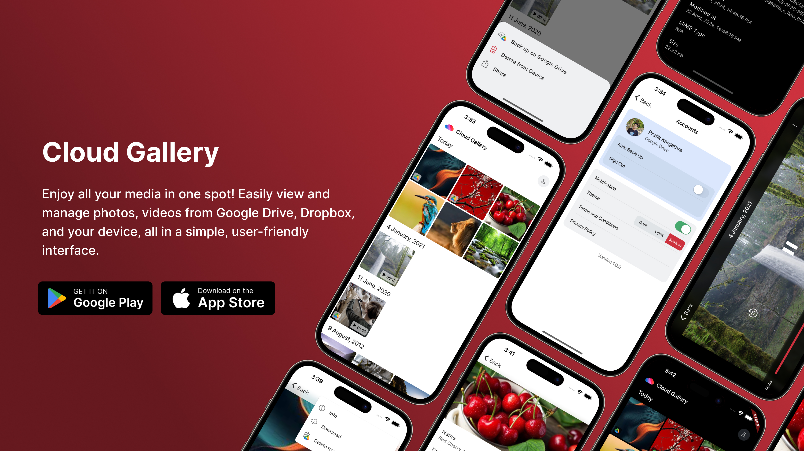

## Overview

Cloud Gallery is an open-source Flutter project that makes managing your photos and videos
effortless. Keep all your media in one place,
whether it’s stored locally or in the cloud with Google Drive or Dropbox. Automatically back up
your local media to the cloud, and seamlessly upload, download, or organize your files anywhere.
It’s the simplest way to keep your memories safe and accessible.

 

## Download App

 

### [terms & Conditions](./terms-and-conditions.md)

### [privacy policy](./privacy-policy.md)

 
